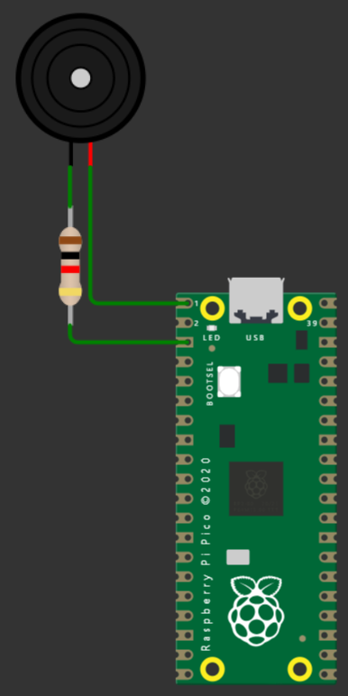

# ponderada-semana1

## Prova conceitual de interface de comunicação de um Raspberry Pi Pico W

A imagem acima mostra uma prova simples do funcionamento das portas do microcontrolador como interface de comunicação. Para o exemplo, será utilizado um buzzer e um resistor.

Antes de tudo, vale citar que foi utilizado um Raspberry Pi Pico ao invés de Pico W, pois o Pico W está em beta no Wokwi e apresenta mal funcionamento.

O ânodo do buzzer foi conectado a porta 1 do microcontrolador diretamente (nota: para testes com peças reais, utilize uma protoboard).

O cánodo do buzzer foi conectado um resistor 1k ômega, que por fim é conectado a porta 3 (Ground) do microcontrolador (nota: no simulador o resistor pode ser removido, mas com peças reais talvez seja necessário utiliza-lo).

O código feito no Wokwi conecta o microcontrolador com o buzzer na função `setup()` (que é executada somente uma vez) e depois entra na função `loop()` (que executa infinitas vezes) para realizar os seguintes comandos:

+ Escolha um número aleatório entre 100 e 1000.
+ Toque um som aleatório com o tom do mesmo número do número selecionado anteriormente.
+ Espere 1 segundo.
+ Pare o som.
+ Espere 1 segundo.
+ Repita o processo.

Ao rodar o código no Wokwi, é possível observar o sucesso na execução das tarefas desejadas e uma prova conceital sobre as interfações de comunicação do Raspberry Pi Pico W.